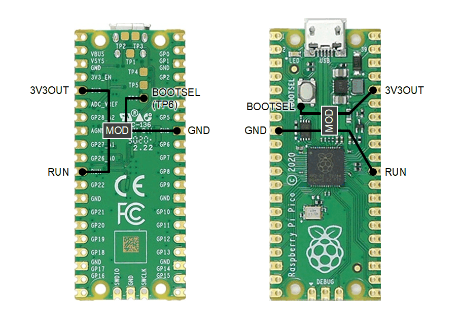

# BootSel2Reset

A mod chip that adds a reset function to the Raspberry Pi Pico's BOOTSEL switch.

- Click BOOTSEL to reset the Pico
- Hold BOOTSEL to enter mass storage mode
- Selectable hold time: 500ms or 4sec

## Video

https://github.com/user-attachments/assets/045de19f-95cd-49d6-bd9e-31ea8d296164

## Connection

## Configuration

|TIMESEL|Hold Time|
|:--|:--|
|Connected to VCC or Open|4 sec|
|Connected to GND|500 ms|

|NOCLICK|Click|
|:--|:--|
|Connected to VCC or Open|Available|
|Connected to GND|Disabled|

> [!NOTE]
> In some applications, the RP2040/RP2350 itself may output a low-level pulse to BOOTSEL, causing a reset. In this case, disable the click function.

## For ATtiny10

Click is always available for ATtiny10.

### Pin Assign

|Pin|ATtiny402|Signal|
|:--:|:--|:--|
|1|PB0 (TPIDATA)|TIMESEL|
|2|GND|GND|
|3|PB1 (TPICLK)|RUN|
|4|PA2|BOOTSEL|
|5|VCC|3V3|
|6|PB3 (RESET)||

### Fuse

Use the default value ​​for the fuse byte.

|Byte|Value|
|:--|:--|
|Fuse|0xFF|

## For ATtiny85

### Pin Assign

|Pin|ATtiny85|Signal|
|:--:|:--|:--|
|1|PB5 (RESET)||
|2|PB3|RUN|
|3|PB4|TIMESEL|
|4|GND|GND|
|5|PB0 (MOSI)|NOCLICK|
|6|PB1 (MISO)||
|7|PB2 (SCK)|BOOTSEL|
|8|VCC|3V3|

### Fuse

Use the default values ​​for the fuse bytes.

|Byte|Value|
|:--|:--|
|High Byte|0xDF|
|Low Byte|0x62|

## For ATtiny402

### Pin Assign

|Pin|ATtiny402|Signal|
|:--:|:--|:--|
|1|VDD|3V3|
|2|PA6|NOCLICK|
|3|PA7||
|4|PA1|BOOTSEL|
|5|PA2|RUN|
|6|PA0 (UPDI)||
|7|PA3|TIMESEL|
|8|GND|GND|

### Fuse

Use the default values ​​for the fuse bytes.

|Byte|Value|
|:--|:--|
|BODCFG|0x01|
|OSCCFG|0x02|
|SYSCFG0|0xF7|
|SYSCFG1|0x07|

## How to Build (Linux/WSL2)

1. Install avr-gcc and add the path to the commands to your `PATH`.
2. Move to the directory corresponding to your desired MCU and run `make`.

A HEX file will be generated under `build/`.
